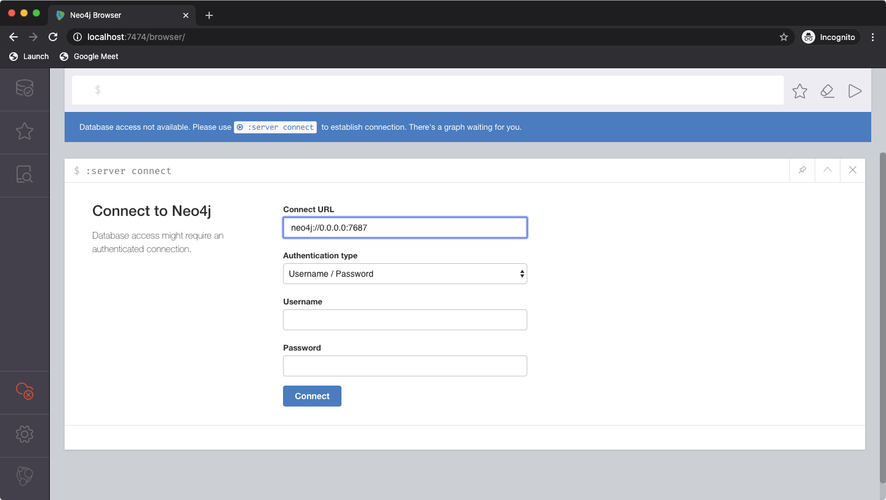
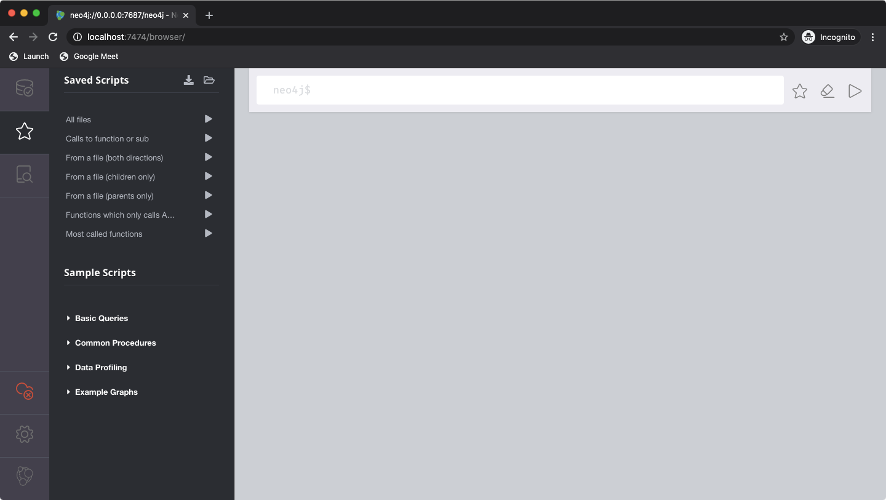

# Setup

## Neo4j

First, check out the project.

Then, start the Neo4j server by running `docker-compose up -d` in the root of the project.
This starts the server in detached mode. It is stopped by doing `docker-compose stop` in the root.

After it is started, [point a browser to http://localhost:7474](http://localhost:7474) to get to the login screen.

Leave username and password empty. The docker-server uses no authentication.

After logging in, open the docs folder and drag the [saved-scripts.zip](saved-scripts.zip) file
onto the main interface. This will upload the scripts and store them in the local browser.

You should have a screen that looks like this:

From there, clicking on the text will load the query in the editor window on the right.

Clicking the arrow on either the editor window or the query list will execute the query.

## Loading data from core-app

Pre-requisite: Check out core-app somewhere

1. `npm install` to ready dependencies
2. `npm run analyze --output data.json <path to core-app>/source/Website`
3. `npm run upload data.json`

The process takes a few minutes. Especially step 2 and 3 can take a couple of minutes each.

After that, the system is ready for querying. Explore the queries loaded above.

[Check out the queries.md page for more detailed descriptions of the bundled queries.](queries.md)
